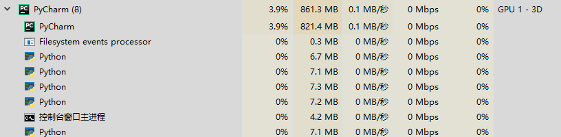

## 一、进程和线程[<sup>参考<sup>❶</sup></sup>]
### 1、概念  
- 进程——对于操作系统来说，一个任务就是一个进程（Process）
- 线程——在一个进程内部，要同时干多件事，就需要同时运行多个“子任务”，我们把进程内的这些“子任务”称为线程（Thread）

### 2、多任务的实现方式
- 多进程模式
- 多线程模式
- 多进程+多线程模式

### 3、疑问
-  *A:由于CPU执行代码都是顺序执行的，那么，单核CPU是怎么执行多任务的呢？*
    >Q:操作系统轮流让各个任务交替执行，任务1执行0.01秒，切换到任务2，任务2执行0.01秒，再切换到任务3，执行0.01秒……这样反复执行下去。表面上看，每个任务都是交替执行的，但是，由于CPU的执行速度实在是太快了，我们感觉就像所有任务都在同时执行一样。

### 4、小结
- 线程是最小的执行单元，而进程由至少一个线程组成
- 如何调度进程和线程，完全由操作系统决定，程序自己不能决定什么时候执行，执行多长时间

## 二、多进程
### 1、`Unix/Linux`操作系统的`fork()`系统
- `Unix/Linux`操作系统提供了一个`fork()`系统调用，它非常特殊。普通的函数调用，调用一次，返回一次，但是fork()调用一次，返回两次，因为操作系统自动把当前进程（称为父进程）复制了一份（称为子进程），然后，分别在父进程和子进程内返回.
- 子进程永远返回`0`，而父进程返回子进程的ID。这样做的理由是，一个父进程可以fork出很多子进程，所以，父进程要记下每个子进程的ID，而子进程只需要调用`getppid()`就可以拿到父进程的ID。
- Python的`os`模块封装了常见的系统调用，其中就包括`fork`，可以在Python程序中创建子进程：
    >
    ```python
        import os

        print('Process (%s) start...' % os.getpid())
        # Only works on Unix/Linux/Mac:
        pid = os.fork()
        if pid == 0:
          print('I am child process (%s) and my parent is %s.' % (os.getpid(), os.getppid()))
        else:
          print('I (%s) just created a child process (%s).' % (os.getpid(), pid))
    ```
- 有了`fork`调用，一个进程在接到新任务时就可以复制出一个子进程来处理新任务，常见的Apache服务器就是由父进程监听端口，每当有新的http请求时，就fork出子进程处理新的http请求。

### 2、Windows平台的多进程服务
- Python的标准库中的`multiprocessing`模块为支持Python跨平台实现多进程
    >`multiprocessing`模块提供了一个`Process`类来代表一个进程对你，下面一个[例子](./multiprocess_001.py  "./multiprocess_001.py")：
    ```python
    # multiprocess_001.py
    from multiprocessing import Process
    import os
    
    
    # 子进程要执行的代码
    def run_proc(name):
        print("执行子进程 {0}({1})".format(name, os.getpid()))
    
    
    if __name__ == "__main__":
        print("父进程{}在执行...".format(os.getpid()))
        # 创建子进程，需要输入一个执行函数和函数的参数，创建一个Process实例
        p = Process(target=run_proc, args=("test",))
        print("接下来执行子进程")
        # 用start()方法启动
        p.start()
        # join()方法可以等待子进程结束后再继续往下运行，通常用地进程间的同步
        p.join()
        print("子进程执行结束！~")
      
    ```
    
    >执行结果如下：
    ```
    父进程9296在执行...
    接下来执行子进程
    执行子进程 test(9040)
    子进程执行结束！~
    ```
    
### 3、使用`multiprocessing`模块中的`Pool`类启动大量子进程
- 如果要启动大量的子进程，可以用进程池的方式批量创建子进程，下面的[例子](./multiprocess_002.py "./multiprocess_002.py")：
    ```python
    # multiprocess_002.py
    from multiprocessing import Pool
    import os, time, random
    
    
    def long_time_task(name):
        print("执行进程{0}({1})...".format(name, os.getpid()))
        start = time.time()
        time.sleep(random.random() * 3)
        end = time.time()
        print("进程{0}执行了{1:.2f}秒".format(name, (end - start)))
    
    
    if __name__ == "__main__":
        print("父进程为：{0}".format(os.getpid()))
        p = Pool(4)
        for i in range(5):
            p.apply_async(long_time_task, args=(i,))
        print("等待所有的子进程执行完毕...")
        # 调用join()方法会等待所有的子进程执行完毕，调用join()之前必须先调用close(),
        # 调用close()后就不能继续添加新的Process了。
        p.close()
        p.join()
        print("所有的子进程已执行完毕！")
    ```
    执行结果为：
    ```
    父进程为：13272
    等待所有的子进程执行完毕...
    执行进程0(1480)...
    执行进程1(1744)...
    执行进程2(13020)...
    执行进程3(5184)...
    进程0执行了1.05秒
    执行进程4(1480)...
    进程4执行了0.03秒
    进程1执行了2.00秒
    进程3执行了2.26秒
    进程2执行了2.36秒
    所有的子进程已执行完毕！
    ```
    可以看到执行时电脑进程数量的变化： 
    - 执行前 
    
    - 执行中
    
    
    请注意输出结果，task0，1，2，3是立刻执行的，而task4要等待前面某个task执行完
    后才执行，这是因为Pool的默认大小在电脑上是4，因此最多同时执行4个进程。
    这是Pool有意设计的限制，并不是操作系统的限制。如果改成`p = Pool(5)`，
    就可以同时跑5个进程。Pool的默认大小是CPU的核数。

### 4、子进程
- 很多时候，子进程并不是自身，而是一个外部进程。我们创建了子进程后还需要控制子进程
的输入和输出。Python标准库中的`subprocess`模块可以很方便地启动一个子进程，然后
控制其输入和输出，下面的[例子](./subprocess_001.py "./subprocess_001.py")
演示了如何在Python代码中运行命令`nslookup www.python.org`，这和命令行直接运行
的效果是一样的：
    ```python
    # subprocess_001.py
    import subprocess
    print("执行命令： nslookup www.python.org")
    r = subprocess.call(["nslookup", "www.python.org"])
    print("Exit code:", r)
    ```
    在Windows10运行结果如下：
    ```
    执行命令： nslookup www.python.org
    ��Ȩ��Ӧ��:
    ������:  UnKnown
    Address:  192.168.0.1
    
    ����:    dualstack.python.map.fastly.net
    Address:  151.101.108.223
    Aliases:  www.python.org
    
    Exit code: 0
    ```
    
    在Linux（Ubuntu）运行如下：
    ```
    lunar@lunar-ubuntu:~/python/pycharm_project/suprocess$ python3 ./subprocess_001.py 
    $ nslookup www.python.org
    Server:		127.0.1.1
    Address:	127.0.1.1#53
    
    Non-authoritative answer:
    www.python.org	canonical name = dualstack.python.map.fastly.net.
    Name:	dualstack.python.map.fastly.net
    Address: 151.101.108.223
    
    Exit code: 0

    ```
    
    如果子进程还需要输入，则可通过`communicate()`方法输入，[例](./suprocess_002.py "./suprocess_002.py")：
    ```python
    # suprocess_002.py
    import subprocess
    
    print("执行命令nslookup")
    p = subprocess.Popen(["nslookup"], stdin=subprocess.PIPE, stdout=subprocess.PIPE,
                         stderr=subprocess.PIPE)
    output, err = p.communicate(b"set q=mx\npython.org\nexit\n")
    print("*"*18)
    print(output.decode("gbk")) # 如果输出有乱码，可尝试使用其他常用编码格式"utf-8"
    print("Exit code:", p.returncode)
    ```
    相当于在命令行执行命令`nslookup`，然后手动输入
    ```
    set q=mx
    python.org
    exit
    ```
    输出为：
    ```
    执行命令nslookup
    ******************
    默认服务器:  UnKnown
    Address:  192.168.0.1
    
    > > 服务器:  UnKnown
    Address:  192.168.0.1
    
    python.org	MX preference = 50, mail exchanger = mail.python.org
    
    python.org	nameserver = ns1.p11.dynect.net
    python.org	nameserver = ns2.p11.dynect.net
    python.org	nameserver = ns3.p11.dynect.net
    python.org	nameserver = ns4.p11.dynect.net
    mail.python.org	internet address = 188.166.95.178
    mail.python.org	AAAA IPv6 address = 2a03:b0c0:2:d0::71:1
    ns1.p11.dynect.net	internet address = 208.78.70.11
    ns1.p11.dynect.net	AAAA IPv6 address = 2001:500:90:1::11
    ns2.p11.dynect.net	internet address = 204.13.250.11
    ns3.p11.dynect.net	internet address = 208.78.71.11
    ns3.p11.dynect.net	AAAA IPv6 address = 2001:500:94:1::11
    ns4.p11.dynect.net	internet address = 204.13.251.11
    > 
    Exit code: 0    
    
    ```

### 5、进程间通信
- `Process`之间肯定是需要通信的，操作系统提供了很多机制来实现进程间的通信。Python的
`umltiprocessing`模块包装了底层的机制，提供了`Queue`，`Pipes`等多种方式来交换数据。
- 以`Queue`为[例](./multiprocess_003.py "./multiprocess_003.py")，
在父进程中创建两个子进程，一个往`Queue`里写数据，一个从`Queue`里读取数据：
    ```python
    # multiprocess_003.py
    
    from multiprocessing import Process, Queue
    import os, time, random
    
    
    # 写数据进程
    def write(q):
        print("执行写数据进程：pid-{0}".format(os.getpid()))
        for value in ["A","B","C","D"]:
            print("正在写{}到队列中...".format(value))
            q.put(value)
            time.sleep(random.random())
    
    
    # 读数据进程
    def read(q):
        print("执行读取数据进程：pid-{}".format(os.getpid()))
        while True:
            value = q.get(True)
            print("从队列中读取到数据：{}".format(value))
    
    
    # 主函数
    if __name__ == "__main__":
        # 父进程创建队列（Queue），并传给各个子进程
        q = Queue()
        process_write = Process(target=write, args=(q,))
        process_read = Process(target=read, args=(q,))
    
        # 启动子进程process_write，写入
        process_write.start()
        # 启动子进程process_read，读取
        process_read.start()
    
        # 等待写入结束
        process_write.join()
    
        # process_read进程是死循环，要强制终止
        process_read.terminate()

    ```
    执行结果如下：
    ```
    执行写数据进程：pid-1052
    正在写A到队列中...
    执行读取数据进程：pid-6172
    从队列中读取到数据：A
    正在写B到队列中...
    从队列中读取到数据：B
    正在写C到队列中...
    从队列中读取到数据：C
    正在写D到队列中...
    从队列中读取到数据：D
    ```
### 6、小结
- 在Unix/Linux下，`multiprocessing`模块封装了`fork()`调用，使我们不需要关注`fork()`
的细节，Windows没有`fork()`调用，因此`multiprocessing`模块需要模拟出`fork()`的效果，
父进程所有的Python对象都必须通过pickle序列化再传到子进程去，所以如果`multiprocessing`在
Windows下调用失败了，要先考虑是不是pickle失败了
- `umltiprocessing`模块可实现跨平台的多进程
- 进程间通信是通过`Queue`、`Pipes`等实现的。

## 三、多线程
### 1、概念
- 进程是由若干线程组成的，一个进程至少有一个线程
- Python的线程模块：
    + `_thread`模块和`threading`模块
    + `_thread`是低级模块，`threading`是高级模块，对`_thread`进行了封装
### 2、启动一个线程
- 启动一个线程就是把一个函数传入并创建`Thread`实例，然后调用`start()`开始执行，如下[例](./multithreading_001.py, "./multithreading_001.py")：
    ```python
    # multithreading_001.py
    
    import time, threading
    
    # 线程要执行的内容：
    def loop():
        print("正在执行线程{}".format(threading.current_thread().name))
        n = 0
        while n < 5:
            n = n + 1
            print("正在执行的线程{0}>>>{1}".format(threading.current_thread().name, n))
            time.sleep(1)
        print("线程{}执行完毕".format(threading.current_thread().name))
    
    if __name__ == "__main__":
        print("线程{}正在执行".format(threading.current_thread().name))
    
        # 创建第二个线程
        t = threading.Thread(target=loop, name="Loop()")
        t.start()
        t.join()
        print("线程{}执行完毕".format(threading.current_thread().name))
    ```
    执行结果如下：
    ```
    线程MainThread正在执行
    正在执行线程Loop()
    正在执行的线程Loop()>>>1
    正在执行的线程Loop()>>>2
    正在执行的线程Loop()>>>3
    正在执行的线程Loop()>>>4
    正在执行的线程Loop()>>>5
    线程Loop()执行完毕
    线程MainThread执行完毕
    ```
    - 任何进程默认就会启动一个线程，我们把该线程称为主线程，
    - 主线程又可以启动新的线程，
    - Python的`threading`模块有个`current_thread()`函数，它返回当前线程的实例。
    - 主线程实例名称是`MainThread`，子线程的名称在创建时指定
    - 线程名称只用来打印，显示用，没有其他意义
    - 如果不给子线程指定名称，Python会自动给线程命名为`Thread-1`，`Thread-2`，...
    
### 3、锁 Lock
- 多进程中，同一个变量各自有一份拷贝存在于每个进程中，互不影响
- 多线程中，所有的变量都由所有线程共享，所以任何一个变量都可以被任何一个线程修改
- 线程之间共享数据最大的危险在于多个线程同时改一个变量，把内容改乱了
- 下面[例子](./multithreading_002.py "./multithreading_002.py")演示了多个线程同时操作一个变量：
    ```python
    # multithreading_002.py
    import time, threading
    
    # balance为全局变量
    balance = 0
    
    
    # 修改balance值
    def change_balance(n):
        global balance
        # 对balance进行先+n再-n的操作，预期结果仍然为0
        balance = balance + n
        balance = balance - n
    
    
    # 线程任务
    def run_thread(n):
        # 线程中调用change_balance 10万次
        for i in range(100000):
            change_balance(n)
    
    
    # 主函数
    if __name__ == "__main__":
        # 创建第一个子线程，执行子进程时+-balance值为5
        t1 = threading.Thread(target=run_thread, args=(5,))
        # 创建第二个子线程，执行子进程时+-balance值为8
        t2 = threading.Thread(target=run_thread, args=(8,))
        # 启动线程
        t1.start()
        t2.start()
        t1.join()
        t2.join()
    
        # 执行完毕打印balance值
        print(balance)
    ```
- 上面的例子定义了一个共享变量`balance`，初始值为`0`，并且启动两个线程，先存后取，理论上结果应该为`0`
，但是由于线程的调度是由操作系统决定的，当t1、t2交替执行时，只要循环次数足够多，`balance`的结果就
不一定是`0`了，是因为修改`balance`需要多条语句，在执行这几条语句时线程可能中断，从而导致多个线程
把同一个对象的内容改乱了。

- 如果要确保`balance`计算正确，就需要给`change_balance()`上一把锁，当某个线程开始执行
`change_balance()`时，称该线程获得了锁，此时其他线程不能同时执行`change_balance()`，
只能等待，直到锁被释放后获得该锁后才能改。由于锁只有一个，无论多少线程，同一时刻最多只有一个线程
持有该锁，所以不会造成修改的冲突。通过`threading.Lock()`创建一个锁。

- 修改上面线程任务内容[如下](./multithreading_003.py "./multithreading_003.py")：
    ```python
    # multithreading_003.py
    import time, threading
    
    # balance为全局变量
    balance = 0
    
    # 实例化一个Lock对象
    lock = threading.Lock()
    
    
    # 修改balance值
    def change_balance(n):
        global balance
        # 对balance进行先+n再-n的操作，预期结果仍然为0
        balance = balance + n
        balance = balance - n
    
    
    # 线程任务
    def run_thread(n):
        # 线程中调用change_balance 10万次
        for i in range(100000):
            # 先获取锁
            lock.acquire()
            try:
                # 修改数据
                change_balance(n)
            finally:
                # 释放锁
                lock.release()
    
    
    # 主函数
    if __name__ == "__main__":
        # 创建第一个子线程，执行子进程时+-balance值为5
        t1 = threading.Thread(target=run_thread, args=(5,))
        # 创建第二个子线程，执行子进程时+-balance值为8
        t2 = threading.Thread(target=run_thread, args=(8,))
        # 启动线程
        t1.start()
        t2.start()
        t1.join()
        t2.join()
    
        # 执行完毕打印balance值
        print(balance)
    ```
- 当多个线程同时执行`lock.acquire()`时，只有一个线程能成功获取锁，然后继续执行，其他线程就继续等待
直到获得锁为止。
- 获得锁的线程用完后一定要释放锁，否则那些等待锁的线程将永远等待下去，成为死线程，用`try...finally`
来确保锁一定会被释放。

- 锁确保了某段关键代码只能由一个线程从头到尾完整地执行，但是阻止了多线程并发执行，包含锁的某段代码只能以
单线程模式执行。由于可以存在多个锁，不同的线程持有不同的锁，并试图获取对方持有的锁时会造成死锁，导致多个
线程全部挂起，既不能执行也无法结束，只能靠操作系统强制终止。

### 4、ThreadLocal
- 什么是`ThreadLocal`？
>`ThreadLocal`是一个线程内部的存储类，可以在指定线程内存储数据，数据存储以后只有指定线程可以
得到存储数据。`ThreadLocal`提供了线程内存储变量的能力，这些变量不同之处在于每一个线程读取的变量是对应的
互相独立的。

- 为什么要使用`ThreadLocal`？
>❶ 在多线程环境中，每一个线程都可以使用所属进程的全局变量。如果一个线程对全局变量进行了修改，将会影响到
其他所有线程对全局变量的计算操作，从而出现数据混乱。为了避免多个线程对变量进行修改，引入了线程同步机制，
通过互斥锁、条件变量或者读写锁来控制对全局变量的访问。  
❷ 只用全局变量并不能满足多线程环境的需求，很多时候线程还需要自己的私有数据，这些数据对其他线程来说是不可
见的。因此线程中也可以使用局部变量，局部变量只有线程自身可以访问，同一个进程下的其他线程不可访问。  
❸ 有时候使用局部变量不太方便（在函数调用的时候[传参](./threadlocal_001.py "./threadlocal_001.py")
很麻烦），因此Python提供了`ThreadLocal`变量，它本身是一个全局变量，但是每个线程却可以利用它来保存属
于自己的私有数据，这些私有数据对其他线程也是不可见的。`ThreadLocal`真正做到了线程之间的数据隔离。
>>下面[例子](./threadlocal_002.py "./threadlocal_002.py")展示了使用`ThreadLocal`实现线程之间的数据隔离:
    
    # threadlocal_002.py
    # 下面例子展示了使用`ThreadLocal`实现线程之间的数据隔离
    
    import threading
    
    
    # 全局的ThreadLocal对象：
    local_school = threading.local()
    
    
    def process_student():
        # 获取当前线程关联的student
        std = local_school.student
        print("你好{}（在线程{}中）".format(std, threading.current_thread().name))
    
    
    def process_thread(name):
        # 绑定ThreadLocal的student:
        local_school.student = name
        process_student()
    
    
    # 主函数
    if __name__ == '__main__':
        t1 = threading.Thread(target=process_thread, args=("A-std", ), name="1")
        t2 = threading.Thread(target=process_thread, args=("B-std", ), name="2")
    
        t1.start()
        t2.start()
        t1.join()
        t2.join()

>>输出为：

    你好A-std（在线程1中）
    你好B-std（在线程2中）

- 全局变量`local_school`就是一个`ThreadLocal`对象，每个`Thread`对它都可以读写`student`属性，但互不影
响。上面示例中每一个线程都可以通过`local_school.x`获取自己独有的数据，并且每个线程读取到的`local_school.x`
都不同，真正做到线程之间的隔离。

***
[<sup>参考<sup>❶</sup></sup>]: https://www.liaoxuefeng.com/wiki/1016959663602400/1017627212385376


